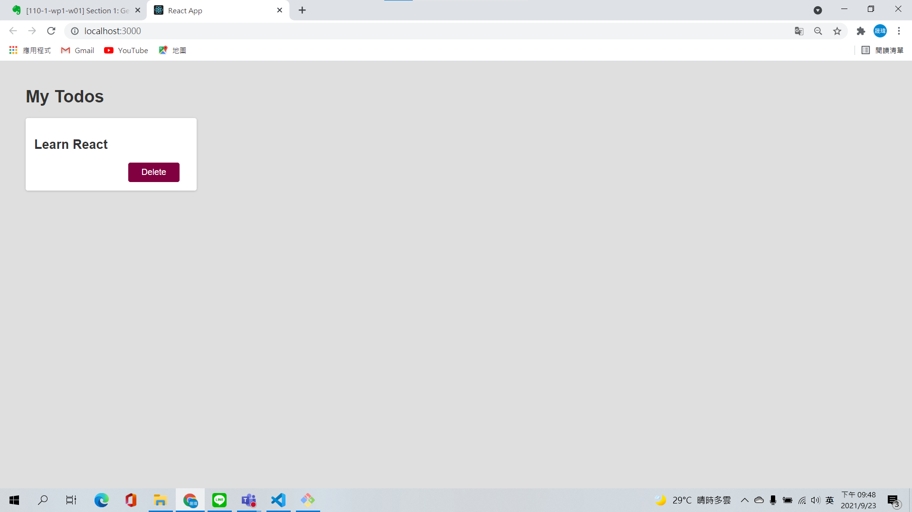
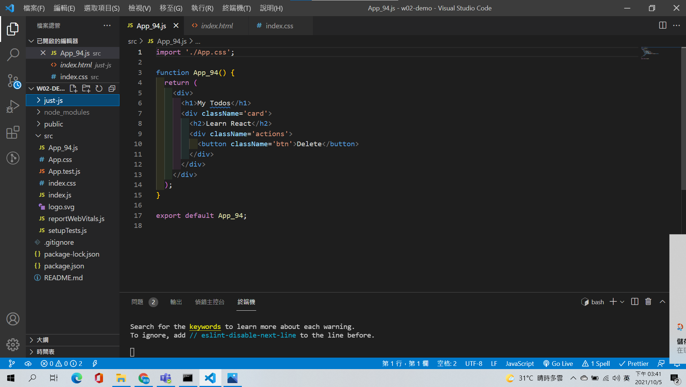
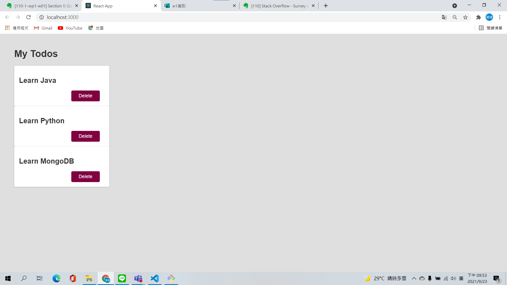
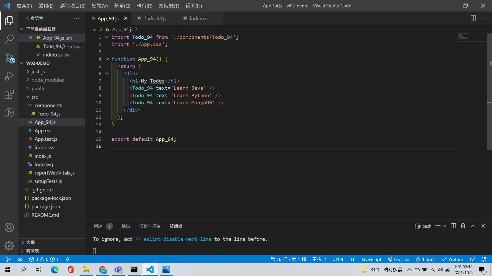
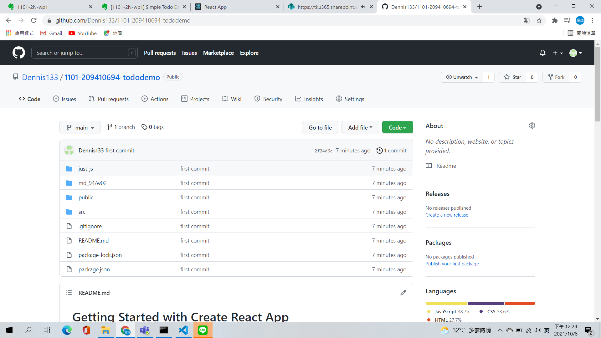
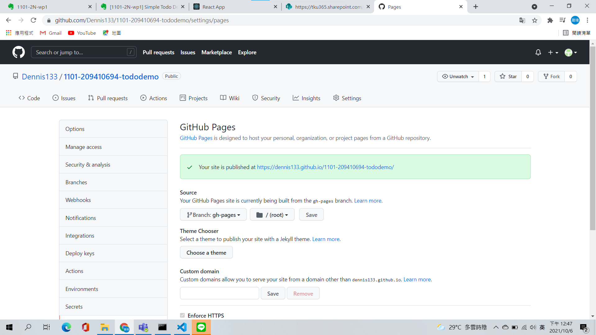
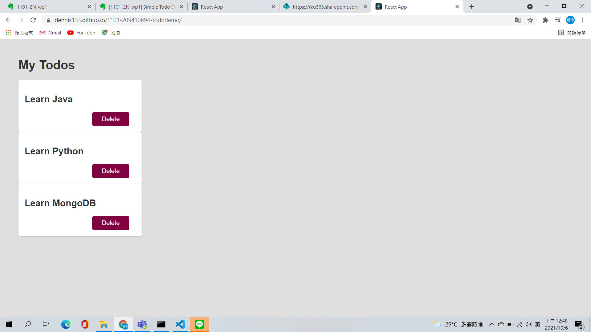
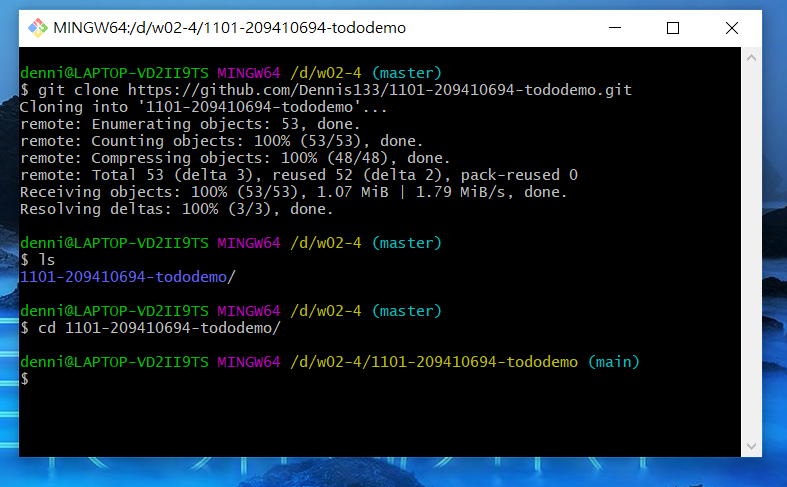
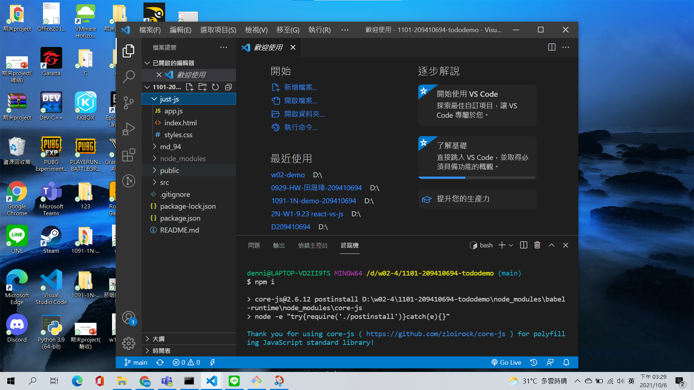
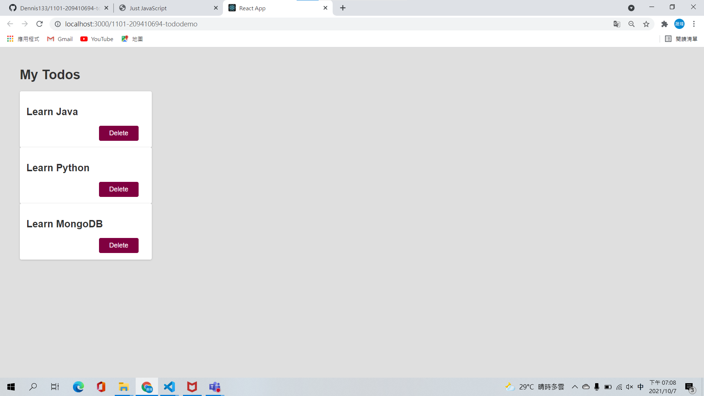

# Todo Demo

1.  將 index.html 中的網頁資訊放入 App_xx.js 中，呈現如下畫面。

- 截圖，可以看到左邊檔案，App_xx.js 及程式碼。注意，此時還沒有 <Todo /> component。
- Chrome 顯示畫面如下，要包含最上面的 URL (localhost:3000)，表示是透過 React 來執行的。

---

2. 將 Todo 資訊放入 <Todo_xx /> 元件中，並能產生三張卡片，內容請自定，不要跟老師一樣。

- 截圖，可以看到左邊檔案，Todo_xx.js 及程式碼。注意 Todo_xx.js 要放入 components 目錄中。
- Chrome 顯示畫面如下，要包含最上面的 URL (localhost:3000)。

---

3. 將目前所完成的 React code 放入 Github 中，建立的 repository 要顯示 id 資訊。

- repository URL 及截圖，可以看到你的原始程式碼，
- Github page 設定之截圖
- Github page URL 及截圖，可以執行 React 程式

[repository URL: https://github.com/Dennis133/1101-209410694-tododemo](https://github.com/Dennis133/1101-209410694-tododemo)

[Github page URL: https://dennis133.github.io/1101-209410694-tododemo/](https://dennis133.github.io/1101-209410694-tododemo/)

---

4. 用 git clone git-repo-url 將上一題 repository 從 Github 下載下來，然後重新安裝，能夠執行的過程。

- 利用 Git bash 或命令提示字元執行 git clone git-repo-url 的圖片，要顯示整個 repo 專案有從 Github 下載
- 進入 VS Code，透過 npm install 安裝 node_modules 的畫面
- 用 npm start 執行，瀏覽器的執行畫面

